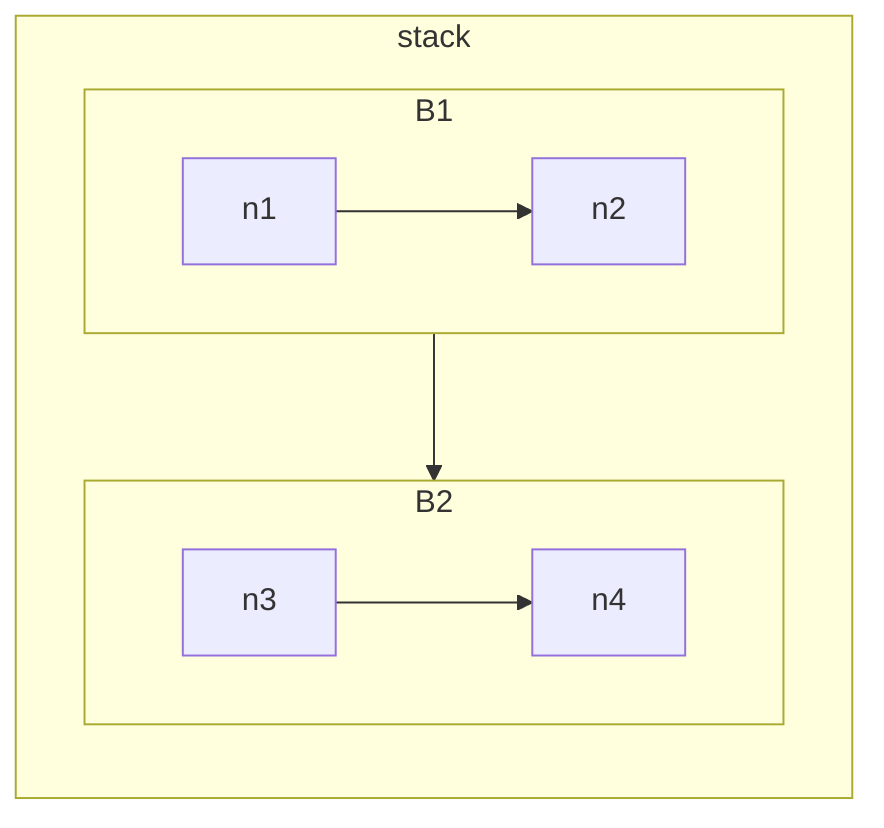

[[RGB相机]]

##### 一：基本术语

1：黑电平校正BLC
暗电流引起黑暗环境下，cmos sensors产生响应，造成非0的blayer rgb图
方案成熟

2：镜头暗角校正
物理原因造成sensors中心比四周的光量多，产生不均匀的渐

3：坏点校正BPC/DPC
检测坏点-->纠正坏点
方案不成熟

4：CFA-bayer color filter array
插值
方案成熟

5：Bayer denoise
双边滤波
方案成熟

6：自动白平衡AWB
避免白色受色温影响
一般处理步骤：检测色温->计算增益->图片校正
现常用算法有：
灰度世界法：假设R、G、B三通道 的均值相等
完美反射法：假设百分比为ratio的最亮的像素是白点

7：CCM颜色校正color corrention matrix
校正除白色以外的其他颜色的饱和度
拍24卡片，再用imatest工具分析

8：gamma校正
人眼和sensors对光线敏感度不同，sensors是对光亮线性的。对于sensors，两盏灯的亮度效果是一盏灯的两倍。

9：HDR或称WDR
自然界光亮度范围很大，人眼感受的较窄，sensors感受的更窄
方案较成熟，主要是tone mapping及其变种
a：global tone mapping
b：local tone mapping

10：YUV去噪和锐化
降噪会丢失细节，需还原

11：AEC自动曝光控制
一般步骤：光强测量->场景分析->曝光补偿(曝光时间、曝光增益ISO、光圈大小)

12：AF,需要马达微调镜头，常用的有音圈马达VCM，步进马达，电压马达
一般步骤：计算不同焦距成像的清晰度->找最清晰图像对应的焦距

13：光学畸变

https://www.optmv.com/content/details113_4276.html

14：AE

##### 二：开发组成

1：sensor规格书
2：电路图驱动
3：I2C驱动
4：dts
kernel->摄像头驱动->media->I2C

##### 岗位要求
1：担任过ISP核心算法（去噪、插值、锐化、颜色链路等模块）的主要开发以及设计，有3年以上ISP算法开发经验
2：有3年以上AF、AE或AWB算法开发经验；
3：掌握sensor曝光时序，掌握各类驱动马达、闪光灯特性及控制策略，对色彩链路有系统性认知者优先，熟悉卡口协议者优先