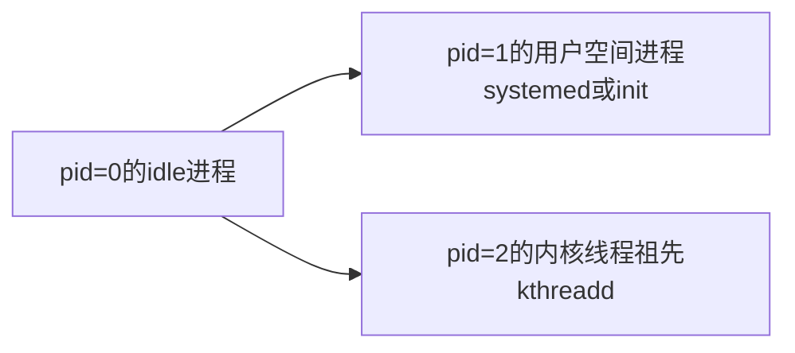

[[Linux]]

内核编译
busybox编译
打包成iso镜像
设置grub
qemu启动

##### 0：前置知识
Linux启动流程

进程pid=0、1、2


##### 一：编译内核、busybox，制作根文件系统、iSO镜像
1：编译环境:ubuntu18、20
```bash
sudo apt-get install git fakeroot build-essential ncurses-dev xz-utils libssl-dev bc flex libelf-dev bison

cp /boot/config-$(uname -r) .config#复制本机config文件到Linux源码根目录

#make ARCH=arm64 CROSS_COMPILE=aarch64-linux-gnu#可选arm平台交叉编译

make menuconfig

make -j10
#为每个平台设置编译目录
#make -j10 O=./build-x64
```

2：编译busybox和制作initrd
initrd或initramfs功能：帮助完成硬件检测、内核模块加载、发现根目录文件需要的设备
一般真正的根目录文件系统启动之后，系统第一个进程init或称为systemed即刻启动。

```
#下载https://github.com/aweeraman/kernel-utils
./mk-initrd
#生成initramfs.cpio.gz，里面包含了 initrc 和 busybox

下面制作iso
#https://juejin.cn/post/7242312269887914041
qemu-system-x86_64 -boot d -cdrom myos.iso -nographic

```


```
如果不借助kernel-utils，需要单独编译busybox和根文件
步骤如下：
1：下载busybox
2：make menuconfig，进入setting->Build options->选定build static binary
3：make&make install，生成在_install目录下
4：cd _install
5：cp -r ../busybox-1.35.0/examples/bootfloppy/etc  .
6：覆盖/etc/inittab文件
::sysinit:/etc/init.d/rcS
::askfirst:/bin/ash
::ctrlaltdel:/sbin/reboot
::shutdown:/sbin/swapoff -a
::shutdown:/bin/umount -a -r
::restart:/sbin/init
7：生成空目录mkdir -p dev etc home lib mnt proc root sys tmp var
8：打包find . -print0 | cpio --null -ov --format=newc | gzip -9 > ../initramfs.cpio.gz
9：启动qemu-system-x86_64 -m 512M  -kernel bzImage -initrd initramfs.cpio.gz -append "init=/linuxrc "
10：完成
```

```
字符界面启动
qemu-system-x86_64 -kernel bzImage -initrd initramfs.cpio.gz -append "console=tty0 console=ttyS0" -nographic
图形界面启动
qemu-system-x86_64 -kernel bzImage -initrd initramfs.cpio.gz -append "init=/linuxrc"
```
https://cloud.tencent.com/developer/article/2169669
https://blog.csdn.net/benkaoya/article/details/129469116

3：制作iso镜像
http://blog.itpub.net/70024420/viewspace-2936625/
https://zhuanlan.zhihu.com/p/47926853

4：删除ubuntu旧的Linux核心和驱动
```bash
#查看
sudo dpkg --list | egrep -i --color 'linux-image|linux-headers'
#卸载
sudo apt --purge remove linux-image-5.15.0-46-generic
sudo apt --purge autoremove
#确认
ls /boot
ls /lib/modules
```

##### 二：qemu调试内核
https://juejin.cn/post/7111214811865677860